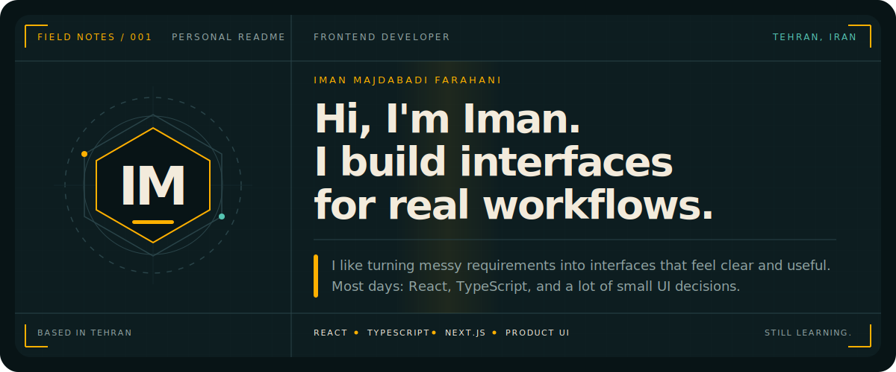
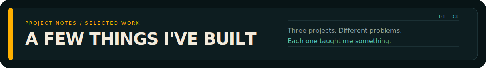
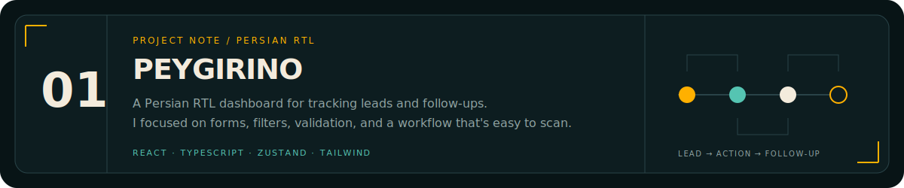
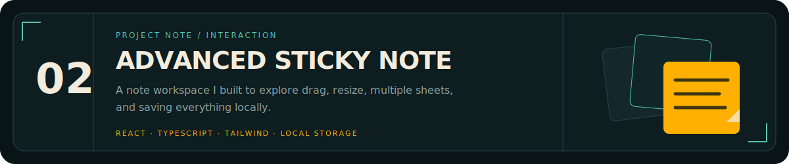
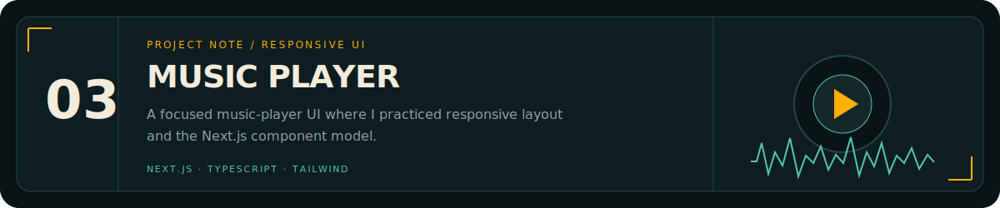
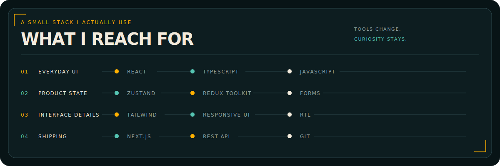
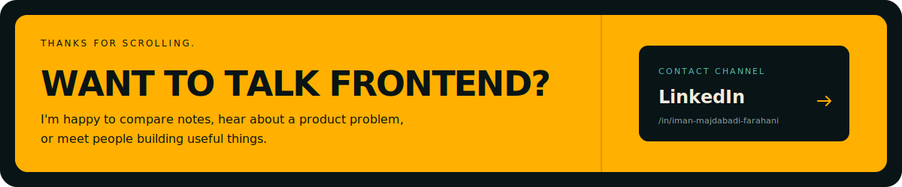

<picture>
  <source media="(max-width: 600px)" srcset="./assets/hero-mobile.svg" />
  
</picture>

 

<picture>
  <source media="(max-width: 600px)" srcset="./assets/section-cases-mobile.svg" />
  
</picture>

<a href="https://github.com/imanmajdabadi-js/peygirino-client-dashboard">
  <picture>
    <source media="(max-width: 600px)" srcset="./assets/case-peygirino-mobile.svg" />
    
  </picture>
</a>

<a href="https://github.com/imanmajdabadi-js/advanced-sticky-note">
  <picture>
    <source media="(max-width: 600px)" srcset="./assets/case-sticky-mobile.svg" />
    
  </picture>
</a>

<a href="https://github.com/imanmajdabadi-js/music-player">
  <picture>
    <source media="(max-width: 600px)" srcset="./assets/case-music-mobile.svg" />
    
  </picture>
</a>

 

<picture>
  <source media="(max-width: 600px)" srcset="./assets/toolkit-mobile.svg" />
  
</picture>

 

<a href="https://www.linkedin.com/in/iman-majdabadi-farahani/">
  <picture>
    <source media="(max-width: 600px)" srcset="./assets/contact-mobile.svg" />
    
  </picture>
</a>

<!--
CASEBOOK PREVIEW — FULL PROFILE DRAFT

This draft intentionally contains only the opening visual. No GitHub profile
repository has been created and nothing has been published yet.
-->
