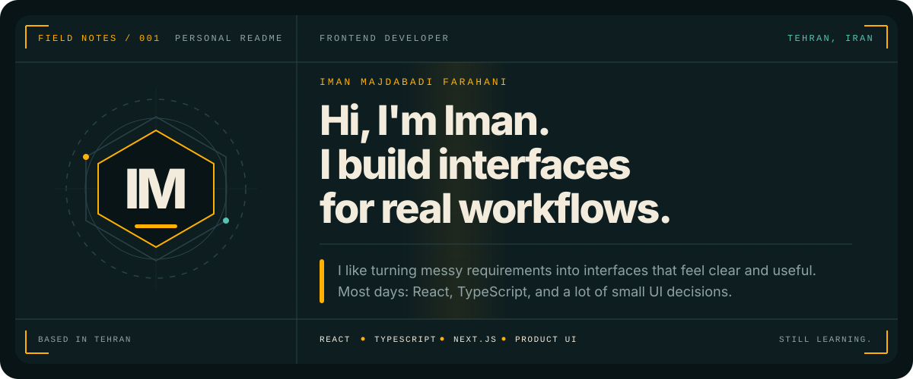
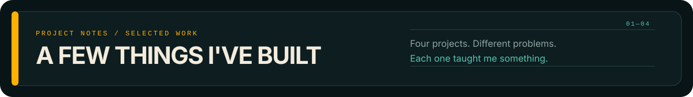
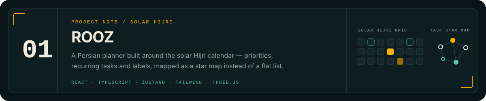
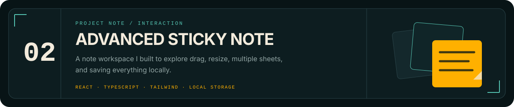
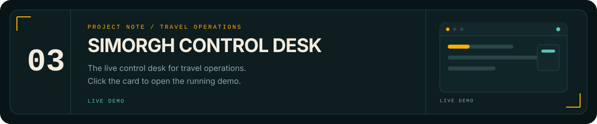
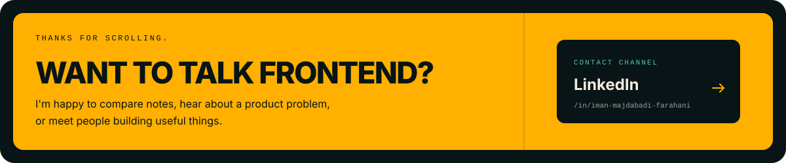

<picture>
  <source media="(max-width: 600px)" srcset="./assets/hero-mobile.svg" />
  
</picture>

  I'm Iman Majdabadi Farahani (ایمان مجدآبادی فراهانی), a frontend developer based in Tehran, Iran. 
  I build practical interfaces for real business workflows using React, TypeScript, and Next.js.

 

<picture>
  <source media="(max-width: 600px)" srcset="./assets/section-cases-mobile.svg" />
  
</picture>

<a href="https://rooz-gold.vercel.app/">
  <picture>
    <source media="(max-width: 600px)" srcset="./assets/case-rooz-mobile.svg" />
    
  </picture>
</a>

<a href="https://advanced-sticky-note.vercel.app/">
  <picture>
    <source media="(max-width: 600px)" srcset="./assets/case-sticky-mobile.svg" />
    
  </picture>
</a>

<a href="https://simorgh-control-desk.vercel.app/">
  <picture>
    <source media="(max-width: 600px)" srcset="./assets/case-simorgh-mobile.svg" />
    
  </picture>
</a>

 

<a href="https://www.linkedin.com/in/iman-majdabadi-farahani/">
  <picture>
    <source media="(max-width: 600px)" srcset="./assets/contact-mobile.svg" />
    
  </picture>
</a>
